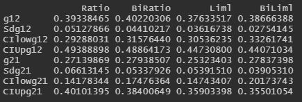

# BiMR
Simulation code for bidirectional Mendelian Randomization model         
This is the 1.0 version of the BiMR simulation code          
Simulation code are in the folder R/            
You can install it using code:         
`library(devtools)`     
`install_github("JinhaoZou/BiMR")`  

## Overview
Other required packages can be installed through      
`install.packages("MendelianRandomization")` (version 0.6.0 was used for manuscript)  
`install.packages("ivmodel")` (version 1.81 was used for manuscript)     
Before run the code, packages should be load             
`library(MendelianRandomization)`       
`library(ivmodel)`    
`library(BiMR)`

There are major three functions: 
- Data.R, a function to generate simulated data
    -  Example: `dat = Data(causal = "uni")`, generating data with unidirectional causal effects between two phenotypes 
    -  Example: `dat = Data(causal = "bi_infi")`, generating data with bidirectional causal effects between two phenotypes
- Est_all.R, a funtion to estimate causal effects from generated data sets
    -  Example: `est.one = Est_all(data = dat$data, method = "all")` generating data estimation with all estimation methods
    -  method can set as "Ratio", "BiRatio", "Liml", "BiLiml" or "all" to estimate causal effects using one or all methods
- Sim_all.R, a function to generate 1000 simulation replicates with estimated causal effects for selected scenario setting 
    -  Example: `Sim_all(causal = "uni", method = "all")`

## Examples for estimation             
The sample data is saved in folder data/     
Name of the data is called `example_dat`, which is a list include five data frames: `con`, `X1`, `X2`, `Y1`, `Y1`.       
`con` is confounder, `Y1` and `Y2` are two phenotypes, `X1` are the instrumental variables for `Y1` and `X2` are the instrumental variables for `Y2`.     
Example for estimation:      
`Est_all(data = example_dat, method = "all")`  
Result for estimation:     

- Each column shows the estimation from each methods 
- Row `g12` represent the estimated causal effects from `Y1` to `Y2`
- Row `Sdg12` represent the S.D. of estimated g12
- Row `CIlowg12` and `CIUpg12` represent the 95% confidence interval for estimation 'g12'
- Row `g21` represent the estimated causal effects from `Y2` to `Y1`
- Row `Sdg21` represent the S.D. of estimated g21
- Row `CIlowg21` and `CIUpg21` represent the 95% confidence interval for estimation 'g21'

